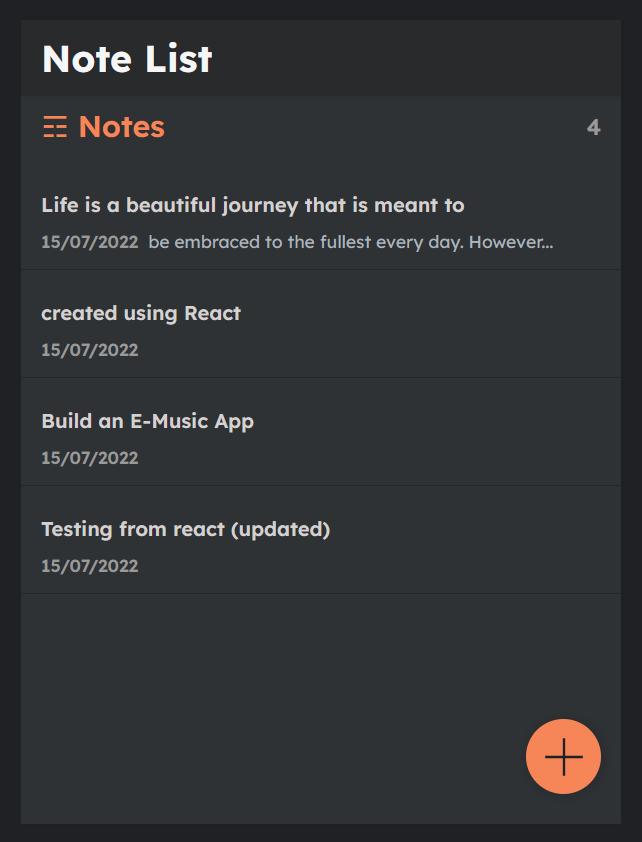

# Installation

- 1 - create a virtual environment and activate
- 2 - pip install virtualenv
      virtualenv envname
      envname\scripts\activate
- 3 - cd into project
- 4 - pip install -r requirements.txt
- 5 - python manage.py runserver

# For any changes in React

- 1 - npm install 
- 2 - npm start
- 3 - npm build

# Tech Stack

- Django
- Django REST Framework
- React

# Home Page

